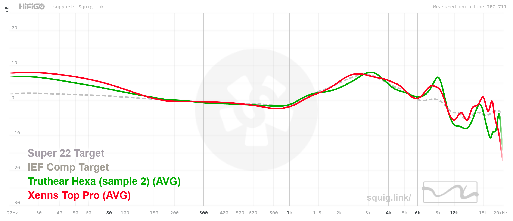
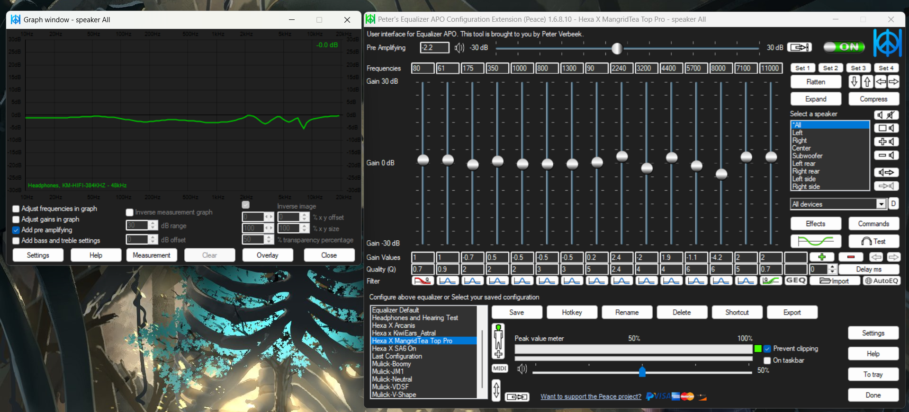
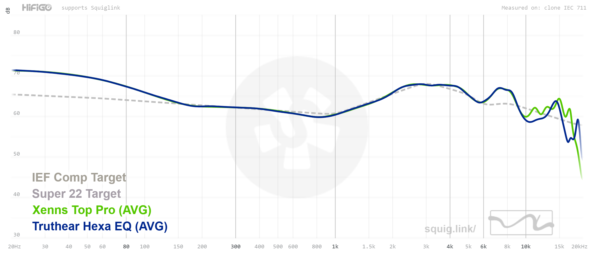

# Mulick Custom EQ
Custom Equalizations for In-Ear Monitors (IEMs), True Wireless Stereo (TWS), and Headphones – Experience Audio Your Way.

---

### About
This repository provides a curated collection of **custom equalization settings** for various audio devices, including **In-Ear Monitors (IEMs)**, **True Wireless Stereo (TWS)** earbuds, and **Over-Ear Headphones**. My goal is to help you enhance your listening experience, correct sonic imperfections, or simply tailor sound to your specific preferences. You'll also find my personal EQ target curves here for those who want to explore their sound philosophies.

---

### Features
* **Comprehensive EQ Presets:** A growing collection of both parametric and graphic EQ presets.
* **Wide Device Compatibility:** Presets tuned for a variety of popular IEMs, TWS, and Headphones.
* **Custom EQ Targets:** Includes my personal EQ target curves, offering unique sound signatures to experiment with.
* **Easy to Use:** Designed for straightforward import into popular EQ applications on both desktop and mobile.

---

### Visualizing the EQ Process
See how these equalization settings transform the sound, from the initial measured response to the final, targeted curve, and how the parameters look in the EQ software.

**1. Pre-EQ Frequency Response**
*The measured frequency response of an IEM before any equalization, compared to the target curve it aims to achieve.*

**2. Imported EQ Parameters in Peace GUI**
*A screenshot showing the imported EQ parameters in the Peace Equalizer application, along with a sample waveform illustrating the applied changes.*

**3. Post-EQ Frequency Response**
*The frequency response of the IEM after applying the custom EQ, demonstrating its alignment with the reference target curve.*

---

### Important Considerations and Disclaimer

Please be aware that while these equalization presets are meticulously crafted to align with specific target curves, the **realistic reproduction of sound cannot be perfectly guaranteed** due to inherent variations in:
* **Driver Setups:** Differences in driver materials, size, and configuration.
* **Hardware Quality:** Variations in manufacturing tolerances and component quality.
* **Acoustic Properties:** The unique acoustic design of each individual earphone or headphone.

**Our Aim:** The primary goal of these tunings is to help you **grasp the intended sound signature** and achieve a desired tonal balance. This can be particularly useful to avoid "purchase mistakes" if you discover you don't like a particular tuning in the first place, or to simply tailor your existing gear to your preference. While a perfect match to the target curve might not always be audibly perceivable, the *intended tuning philosophy* will be conveyed.

---

### Equalization Folders Explained
This repository is organized to help you easily find the right equalization presets for your specific audio device and desired sound signature. The structure follows a clear hierarchy:

* **`IEMs/`**: Contains EQ presets specifically tuned for various **In-Ear Monitors**.
* **`TWS/`**: Contains EQ presets specifically tuned for various **True Wireless Stereo** earbuds.
* **`Headphones/`**: Contains EQ presets specifically tuned for various **Over-Ear Headphones**.
* **`My EQ Targets/`**: This folder houses my custom EQ target curves. These are not device-specific but rather represent personal sound signatures I aim for, which can be applied and adjusted to any device to achieve a particular tonal balance.

#### Navigating Inside Device Folders (`IEMs/`, `TWS/`, `Headphones/`)

Once you select a device category (e.g., `IEMs/`), you'll find a nested structure designed for precision:

1.  **`<Brand Name>/`**:
    * This first level organizes presets by the **manufacturer or brand** of your audio device (e.g., `TruthEar/`).
2.  **`<Unit Name>/`**:
    * Inside the brand folder, you'll find folders for specific **models or units** from that brand (e.g., within `TruthEar/`, you might find `Hexa/`).
3.  **`<Target/Reference Name>/`**:
    * This is a crucial level. Inside the unit folder, you'll find sub-folders indicating the **target curve or reference tuning** that the EQ aims to achieve for that specific unit. Examples include:
        * `IEM/` (e.g., targeting the sound of another specific IEM model)
        * `My Reference/` (my preferred general reference tuning)
        * `My Own Target/` (my unique, personal target curve for a particular sound)

#### Contents Within Each `<Target/Reference Name>/` Folder

Upon opening a `<Target/Reference Name>/` folder (e.g., `IEMs/TruthEar/Hexa/My Reference/`), you will typically find the following files:

* **`<IEM> X <Reference>_parametric.txt`**:
    * This text file contains the precise **parametric EQ parameters** (filter type, frequency, gain, Q-factor) that you can import into software like Equalizer APO and Peace GUI.
* **`<IEM> X <Reference>_wavelet_graphicEQ.txt`**:
    * This text file contains the **graphic EQ parameters** specifically formatted for import into the Wavelet Android application.
* **`Comparison.png`**:
    * An image showing the **"before" state** of the equalization. It displays the raw, un-EQ'd frequency response of your specific IEM (e.g., Hexa) compared directly against the chosen target/reference curve (e.g., "My Reference"). This helps you visualize the initial deviation.
* **`Final.png`**:
    * An image showing the **"after" state** of the equalization. It displays the frequency response of your IEM *after* applying the EQ parameters, demonstrating how closely it aligns with the target/reference curve. This helps you confirm the intended tuning has been achieved.

---

### Getting Started: Comprehensive Setup & Usage Guide
To get started with installing and using these EQ presets on your Windows PC (Equalizer APO + Peace GUI) or Android device (Wavelet), along with additional useful tips, please refer to our comprehensive guide:

* **Mulick Custom EQ: Comprehensive Setup & Usage Guide (Equalizer APO, Peace, Wavelet, & Advanced Tips):**
    [[https://docs.google.com/document/d/1cmlCGibwocOL03Ga_N4iiBzhU7DekrtyrgsZm1OgUhk/edit?tab=t.0](https://docs.google.com/document/d/1cmlCGibwocOL03Ga_N4iiBzhU7DekrtyrgsZm1OgUhk/edit?usp=sharing)

This single document covers:
* Detailed installation and configuration of **Equalizer APO and Peace GUI**.
* Step-by-step instructions for installing and using **Wavelet on Android**.
* **Additional tips and tricks** to optimize your equalization experience.

---

#### General Instructions
Once you have your chosen EQ software installed and configured via the comprehensive guide:
1.  **Locate the specific folder for your device and target tuning** by navigating through the repository's explained structure (e.g., `IEMs/<Brand Name>/<Unit Name>/<Target/Reference Name>/`).
2.  Locate the `.txt` or other preset file corresponding to your device and desired sound signature (e.g., `<IEM> X <Reference>_parametric.txt` or `<IEM> X <Reference>_wavelet_graphicEQ.txt`).
3.  Follow the specific import instructions within your EQ software (as detailed in the comprehensive guide) to load the equalization values.

---

### Contact
If you have any questions, need assistance, or just want to discuss audio, feel free to:
* Open an [issue on this GitHub repository](https://github.com/Spincies/Mulick-Custom-EQ/issues).
* Reach out to me at [mulickz16@gmail.com].

---
